<div align="center">

<!-- Image Gallery -->
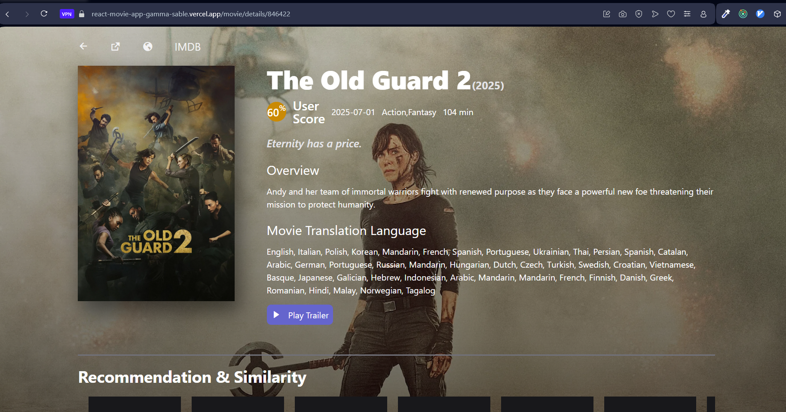
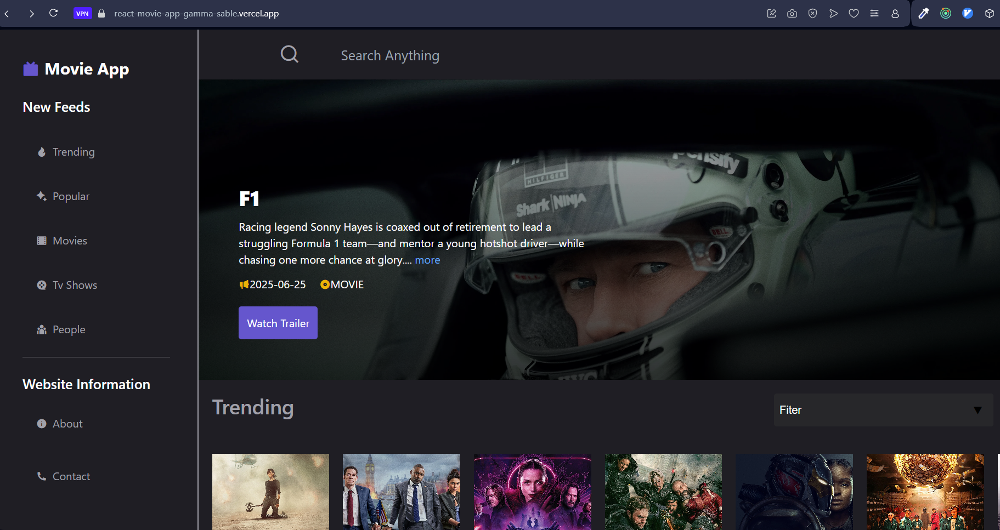
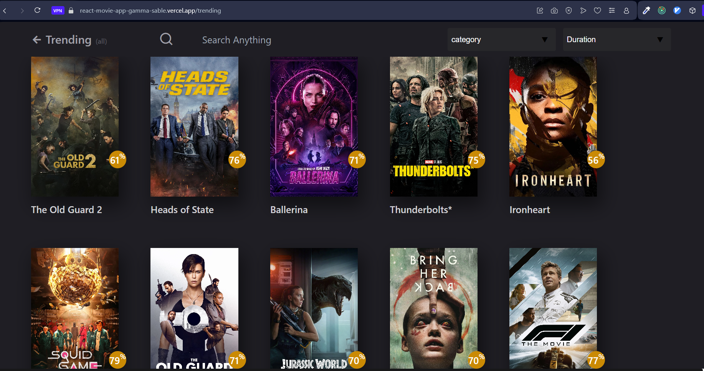
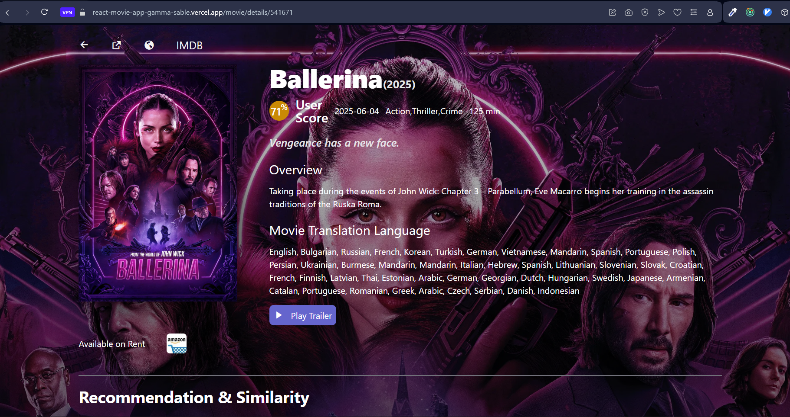

<h1>🎬 Movie App React</h1>
<p>A modern, responsive movie and TV show web application built with React, Redux Toolkit, and Tailwind CSS. Browse trending movies, TV shows, view details, and more!</p>

</div>

---

## 🚀 Features

- Browse trending and popular movies & TV shows
- View detailed information about movies, TV shows, and people
- Search functionality
- Recommendations and similar content
- Watch provider info (stream, rent, buy)
- Responsive design
- Loading indicators and error handling

## 🖼️ More Screenshots

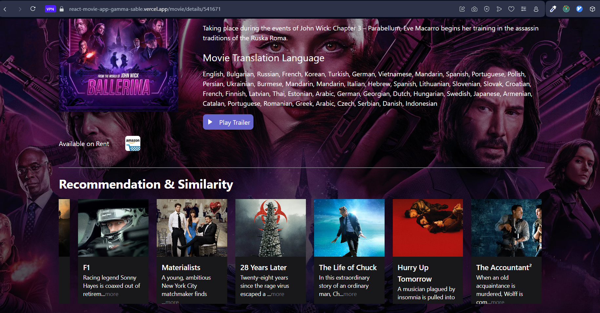
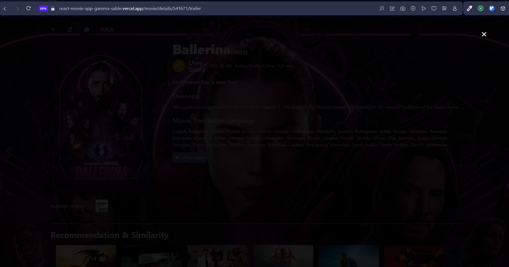
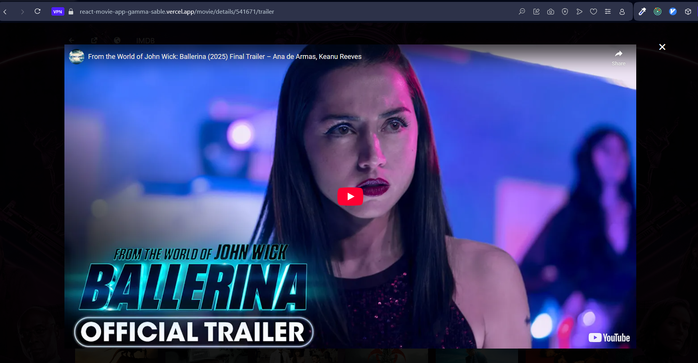
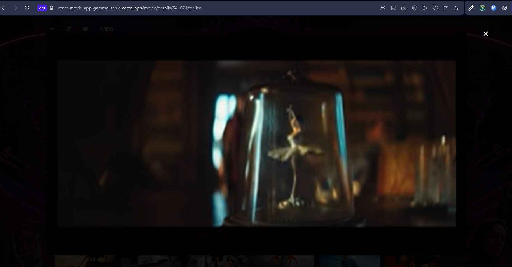
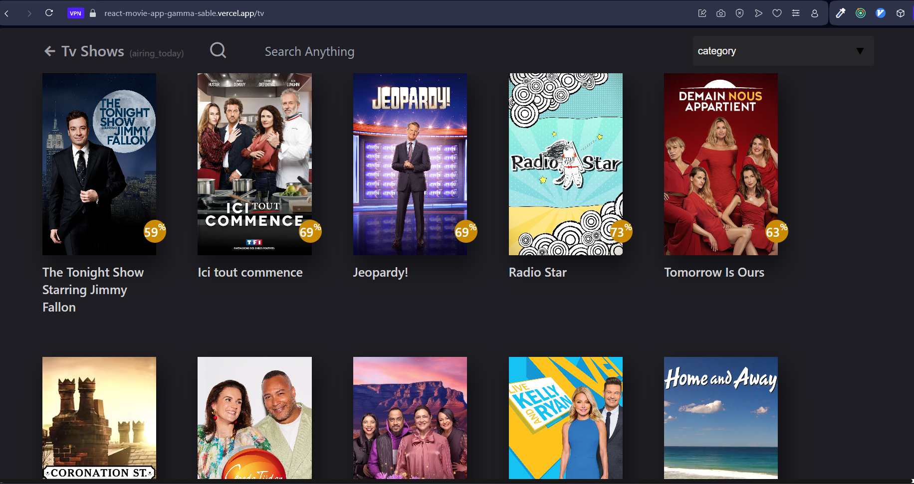
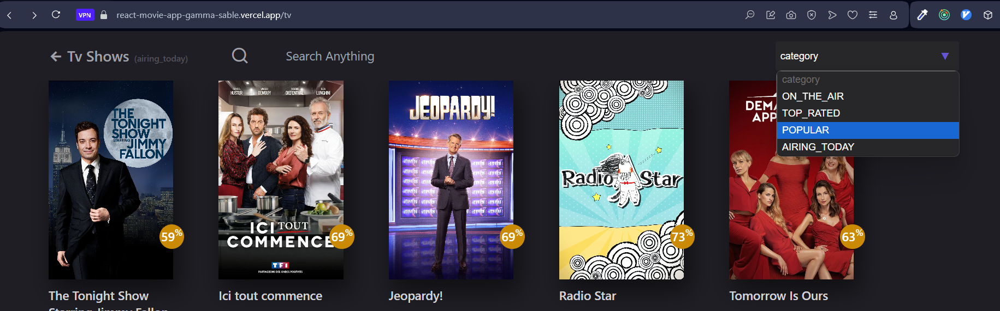
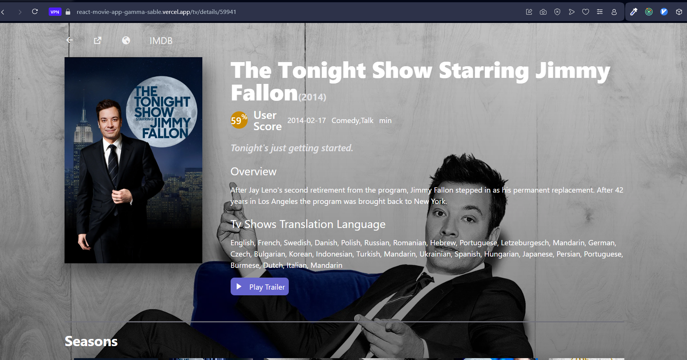
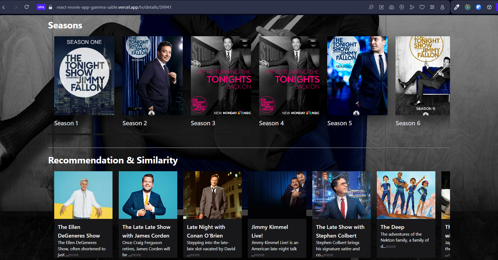
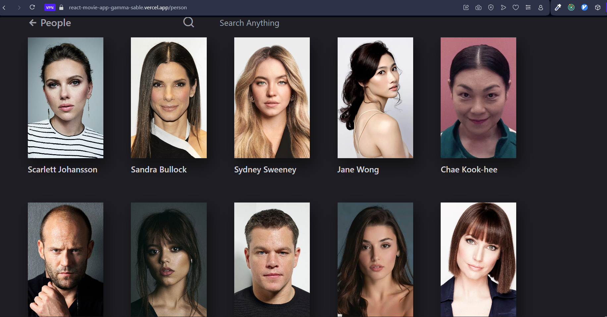
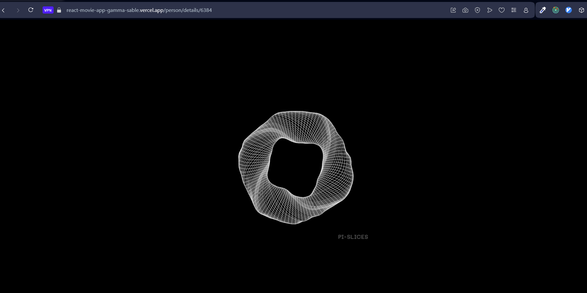
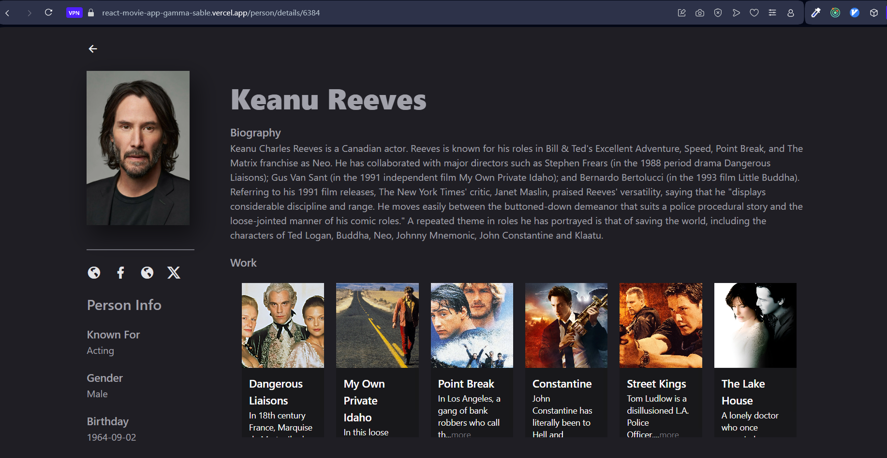
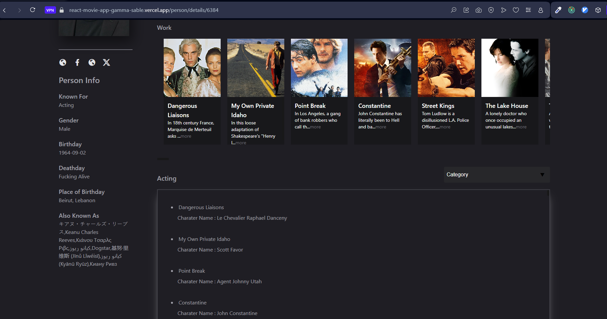

---

## 🛠️ Tech Stack

- [React](https://reactjs.org/)
- [Redux Toolkit](https://redux-toolkit.js.org/)
- [Tailwind CSS](https://tailwindcss.com/)
- [Vite](https://vitejs.dev/)
- [Axios](https://axios-http.com/)
- [The Movie Database (TMDb) API](https://www.themoviedb.org/documentation/api)

---

## 📂 Project Structure

```
MOVIEAPPREACT/
  ├── assets/                # Documentation images (for README)
  ├── public/                # Static assets for the app
  ├── src/                   # Source code
  │   ├── components/        # React components
  │   ├── store/             # Redux store, actions, reducers
  │   ├── utils/             # Utility functions (e.g., Axios config)
  │   └── main.jsx           # App entry point
  ├── package.json
  ├── README.md
  └── ...
```

---

## 🏁 Getting Started

### Prerequisites
- Node.js (v14 or higher)
- npm

### Installation

1. **Clone the repository:**
    ```bash
    git clone https://github.com/yourusername/MOVIEAPPREACT.git
    cd MOVIEAPPREACT
    ```
2. **Install dependencies:**
    ```bash
    npm install
    ```
3. **Start the development server:**
    ```bash
    npm run dev
    ```

4. **copy you .env.local to .env:**
    ```bash
    npm run dev
    ```

5. **Open** [http://localhost:5173](http://localhost:5173) **in your browser.use VPN**

---

## 🌐 API & Configuration

- This app uses [The Movie Database (TMDb) API](https://www.themoviedb.org/documentation/api) for all movie, TV, and people data.
- API configuration is located in `src/utils/axios.jsx`.

---

## ✨ Customization

- Update API endpoints or keys in `src/utils/axios.jsx` as needed.

---

<div align="center">
  <sub>Made with ❤️ using React, Redux Toolkit, and TMDb API</sub>
</div>
